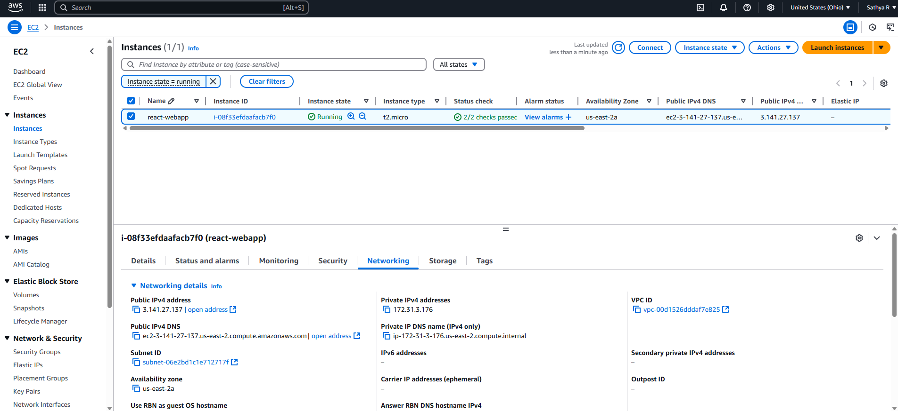
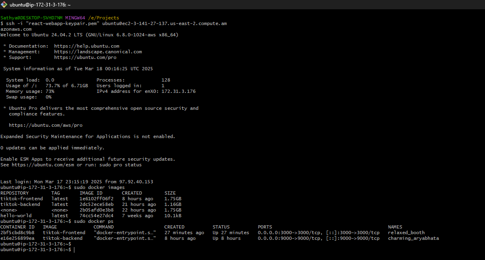
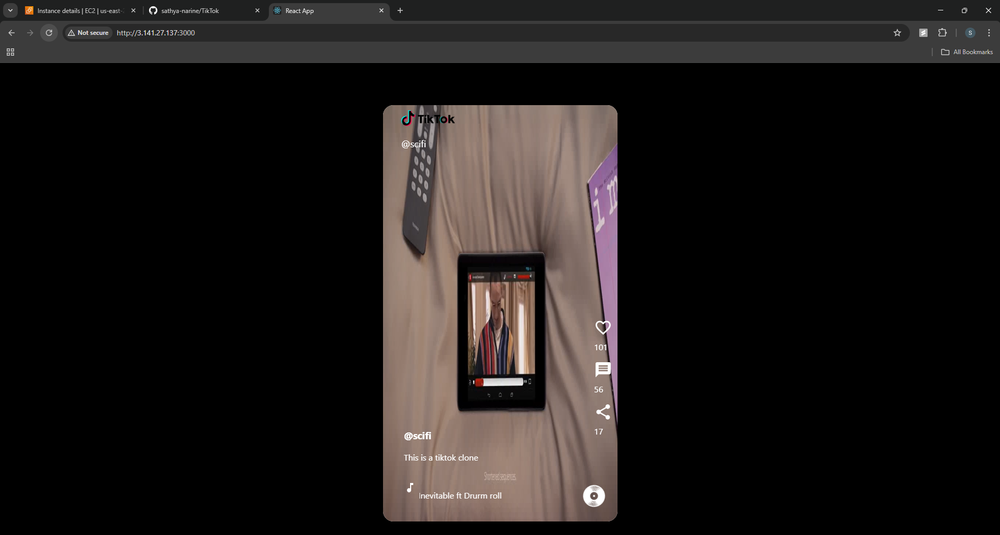

# Deploying MERN Project on AWS using Docker

## 1. Create AWS Account
- If you don't have an AWS account, sign up for a new one.
- New users get a free tier for one year.

## 2. Launch an EC2 Instance
- Log in to AWS and search for **EC2** under services.
- Click on **Create Instance**.
- Provide a meaningful name for the instance.
- Select **Ubuntu Free Tier** as the OS image.
- Generate a new key pair, download the `.pem` file.
- Rename the security group to a meaningful name.
- Add the following rule to the security group:
  - **Type:** SSH
  - **Source:** My IP (allows only your system to access the instance).
- Click **Create Instance**.

## 3. Connect to the EC2 Instance
- Open Git Bash or a CLI in the same folder where the `.pem` file is downloaded.
- Use the SSH command provided under **Instances → Connect** to access the instance.

## 4. Update and Upgrade Ubuntu
```bash
sudo apt update
sudo apt upgrade
```

## 5. Install Docker on Ubuntu
Refer to the official Docker installation guide: [Docker for Ubuntu](https://docs.docker.com/engine/install/ubuntu/)

Run the following commands to install Docker:
```bash
# Add Docker's official GPG key:
sudo apt-get update
sudo apt-get install ca-certificates curl
sudo install -m 0755 -d /etc/apt/keyrings
sudo curl -fsSL https://download.docker.com/linux/ubuntu/gpg -o /etc/apt/keyrings/docker.asc
sudo chmod a+r /etc/apt/keyrings/docker.asc

# Add the repository to Apt sources:
echo \  
  "deb [arch=$(dpkg --print-architecture) signed-by=/etc/apt/keyrings/docker.asc] https://download.docker.com/linux/ubuntu \  
  $(. /etc/os-release && echo "${UBUNTU_CODENAME:-$VERSION_CODENAME}") stable" | \  
  sudo tee /etc/apt/sources.list.d/docker.list > /dev/null
sudo apt-get update
```

## 6. Clone and Set Up the MERN Project
```bash
git clone https://github.com/sathya-narine/TikTok
cd TikTok/tiktok-backend
vi .env
```
- Paste the **MongoDB URI** in the `.env` file and save it.

## 7. Build and Run Docker Containers
### Frontend
```bash
cd TikTok/tiktok

docker build -t tiktok-frontend .
docker images  # Verify image creation
docker run -d -p 3000:3000 --name tiktok-frontend tiktok-frontend
docker ps  # Verify container is running
```
### Backend
```bash
cd TikTok/tiktok-backend

docker build -t tiktok-backend .
docker run -d -p 9000:9000 --name tiktok-backend tiktok-backend
```

## 8. Configure Security Group for Web Access
- In the **Security Group** of the instance, add the following rules:
  - **TCP Port 3000** → Source: Any IP (for frontend access).
  - **TCP Port 9000** (if needed) → Source: Custom IP (EC2 Instance IP or Any, though not recommended).

## 9. Access the Hosted App
- Copy the **Public IPv4 Address** of the EC2 instance.
- Open a browser and visit: `http://<public-ip>:3000`
- Your MERN project should now be accessible.

*(Optional: Ensure frontend can communicate with backend by adjusting security group settings for port 9000 if required.)*
