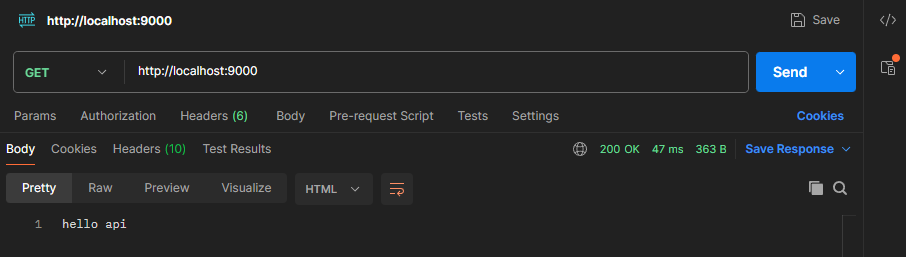
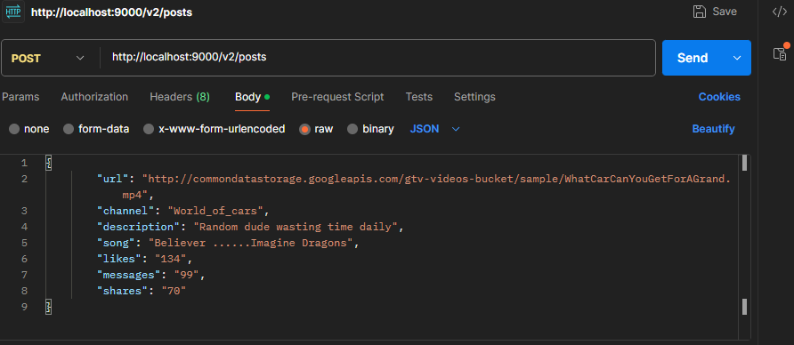
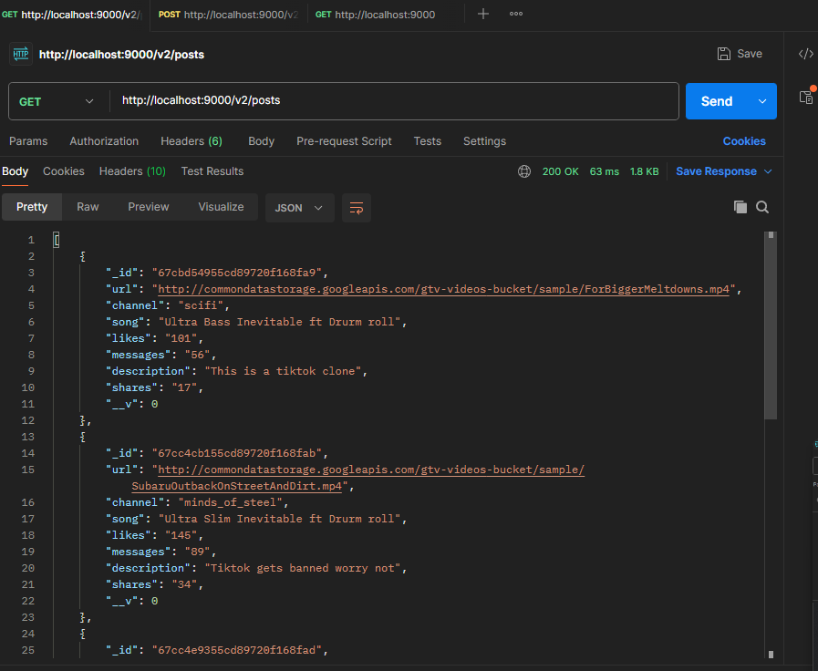

# Backend Implementation - MERN Stack

## Overview
The backend of the TikTok clone is built using **Node.js** and **Express** for handling API requests, and **MongoDB** for data storage. The backend serves three main API endpoints: one for pushing data to the database, one for retrieving data, and one for serving as the primary endpoint for the frontend to interact with. The backend is also containerized using **Docker** to make it easy to deploy.

### What is Node.js and Express?
- **Node.js** is a JavaScript runtime built on Chrome's V8 JavaScript engine. It enables developers to run JavaScript server-side, which is typically used for building scalable network applications.
- **Express.js** is a web application framework for Node.js that simplifies the development of web servers and APIs. It provides a robust set of features for building web and mobile applications, such as handling HTTP requests, managing routing, middleware support, etc.

---

## Setting Up the Backend

1. **Navigate to the Backend Folder**  
   In your project directory, navigate to the `tiktok-backend` folder:
   ```sh
   cd tiktok-backend

2. **Initialize the Project**
   Initialize a new Node.js project with the following command:
   ```sh
   npm init
3. **Configure the package.json File**
   After initializing the project, update the package.json file:

  Set the entry point to server.js
  Add "type": "module" to use ES6 modules (this will enable import and export syntax)
  Under the "scripts" section, include the start script:
 
  "scripts": { "start": "node server.js"}

4. **Install Dependencies**
  Install Express and Mongoose for handling API requests and MongoDB operations:
  Install Nodemon globally to automatically restart the server during development when files are changed:
   ```sh
   npm i express mongoose
   npm i -g nodemon
   
## MongoDB Setup
MongoDB is used to store the data for the app. Below are the steps to create a MongoDB cluster and set up the necessary collections:

1. **Create a MongoDB Cluster**
Sign up for MongoDB Atlas (if you don’t already have an account) at MongoDB Atlas.
Once logged in, click on "Create a New Cluster" to set up a cloud cluster.
Select your preferred cloud provider (AWS, GCP, or Azure) and region, and click Create Cluster.
2. **Create Collections**
After your cluster is created, go to the Database tab.
Create a new database by clicking on "Create Database", and name it appropriately (e.g., tiktok-clone).
Inside the database, create collections (e.g., posts, users, etc.).
3. **Obtain the MongoDB URI**
Go to the Database Access tab and create a new database user with appropriate permissions.
Go to the Network Access tab and add your IP to the "IP Whitelist" to allow access.
Now, obtain the MongoDB URI from the Cluster tab. The URI will look something like this:
MONGO_URI=mongodb+srv://<user>:<password>@cluster0.psdwk.mongodb.net/<collection>?retryWrites=true&w=majority&appName=Cluster0
4. **Setting IP in Network Security**
Under the Network Access tab, ensure your IP address or the IP address range is whitelisted. You can set this to 0.0.0.0/0 for global access or specify a range if you want to limit the access to certain IP addresses.

For security reasons, the MongoDB URI and other sensitive information should not be hardcoded in the project files. Create a .env file with in same directory to store environment variables like the MongoDB URI.
Example:
MONGO_URI=mongodb+srv://<user>:<password>@cluster0.psdwk.mongodb.net/<collection>?retryWrites=true&w=majority&appName=Cluster0

Test API Endpoints in Postman





