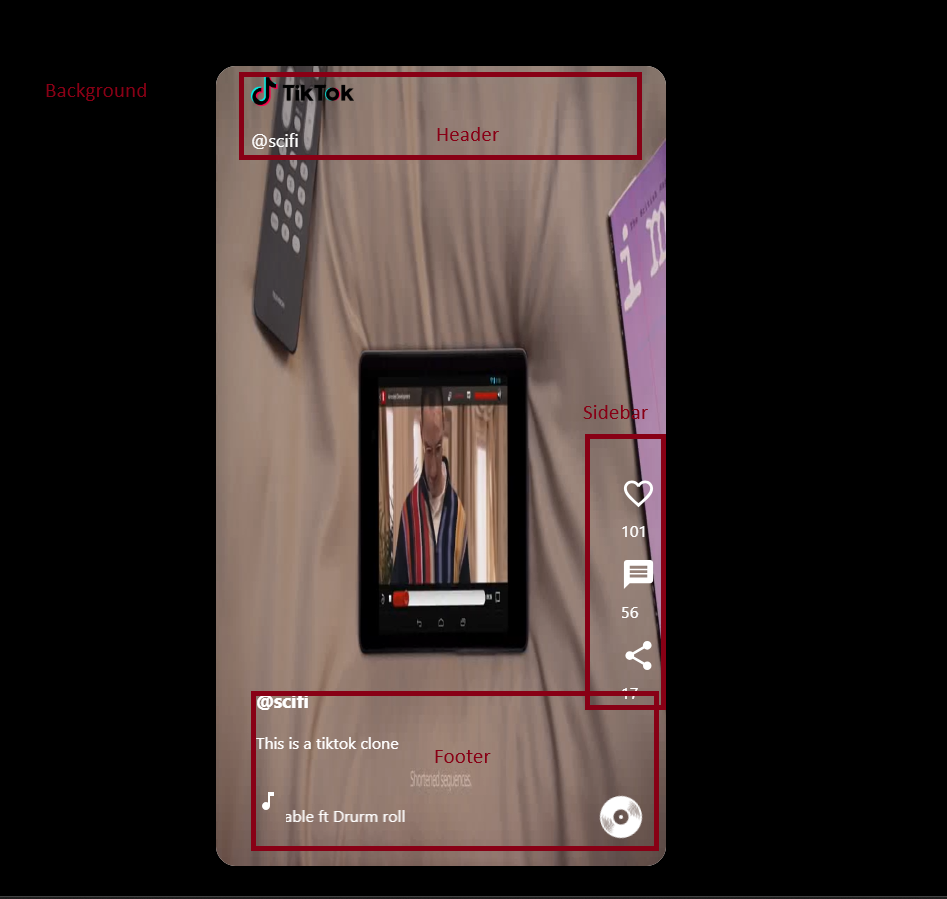

# TikTok Clone Project Implementation

## Overview
This project is a clone of the popular TikTok app built with React for the frontend and other tools for backend and deployment. The primary functionality implemented so far is a video feed where users can scroll, like, and interact with content. Features such as comments and shares are planned for future development.

---

## Frontend Implementation

### Overview
The frontend of the TikTok clone is built using React, with a focus on a clean and responsive UI. The main feature implemented is a scrolling video feed, where users can click on a video to pause or play it. The UI is divided into several sections to mimic the layout of TikTok.

### UI Breakdown
The UI is divided into the following sections:
- **Body**: This is the background layout where videos are displayed.
- **Footer**: Contains the channel name, video description, song details, and a rotating disc animation.
- **Sidebar**: Displays the like, comment, and share buttons.
- **Header**: Displays the app logo and channel name.

A labeled image will be provided to visually demonstrate these sections.


### Setting Up the Frontend
To get started with the frontend, follow these steps:

1. **Install Node.js**  
   Make sure you have Node.js installed on your machine.

2. **Create a React App**  
   Use the following commands to create and start a new React app:
   ```sh
   npx create-react-app tiktok
   cd tiktok
   npm start
3. **Clean Up Default Files**
   Remove unnecessary default files from the src directory:
   ```sh
   rm src/App.test.js src/logo.svg src/setupTests.js
4. **Install Required Packages
   Install the following packages for UI components and functionality:
   ```sh
   npm install @mui/icons-material
   npm install react-ticker --force
5. **Organize UI Components
   All UI components are placed inside the src directory for better maintainability and structure.

## Helpful Video Resource
I followed this tutorial to implement the basic functionality of the TikTok clone. It covers the core React setup and UI structure:
https://www.youtube.com/watch?v=g8yGxDMyGiE

